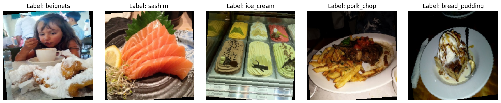
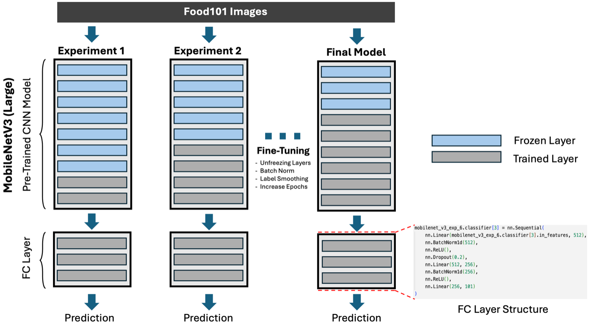

# Food101 Image Classification with Transfer Learning

Image classification is a core task in computer vision, enabling machines to interpret and categorise images. Convolutional Neural Networks (CNNs) are widely used for this task due to their ability to automatically learn features from raw image data, making them highly effective across applications such as healthcare, agriculture, security and autonomous vehicles.

A major challenge in image classification is the need for large labelled datsets and significant computational resources to train deep models from scratch. **Transfer learning** addresses this issue by using CNNs pre-trained on large-scaled datasets like ImageNet, allowing models to adapt to new tasks with smaller datasets and faster convergence.

This project explores **transfer learning for image classificaiton** using the **Food101 dataset** and implements experiments in **PyTorch**.

## Key objectives
* Compare three pre-trained CNN architectures: **GoogLeNet, MobileNetV3 (Large) and ResNet50.**
* Apply transfer learning and evaluate baseline performance without fine-tuning.
* Fine-tune the most promising model to improve classification accuracy.
* Analyse limitaitons observed during experiments and suggest improvements or applications.

## Dataset: Food101

The Food101 dataset contains 101,000 images spanning 101 food categories, with:
* 750 training images per class
* 250 testing images per class

The dataset is balanced and reflects real-world variability, with natural, user-generated content. This diversity makes Food101 an excellent benchmark for evaluating the generalisability of pre-trained CNNs.

Some sample images of the Food 101 dataset:


Example challenges:

* Images often include distracting elements (e.g., people in the frame)
* Food items may appear in containers or partially obstructed

These factors require models to learn robust and generalisable features.

## Model Architectures Explored

| Model                   | Key Features                                                  |
| ----------------------- | ------------------------------------------------------------- |
| **GoogLeNet**           | Inception modules with multi-scale feature extraction         |
| **MobileNetV3 (Large)** | Lightweight, efficient, uses depthwise separable convolutions |
| **ResNet50**            | Residual connections for training deep networks effectively   |

## Project Workflow

**1. Baseline Evaluation:** Apply transfer learning to all three architectures without fine-tuning.

**2. Performance Comparison:** Identify the most primising architecture based on validation accuracy.

**3. Fine-Tuning:** Improve classification performance by training the last few layers of the selected model.

**4. Analysis & Insights:** Evaluate limitations, overfitting, and challenges in the Food101 dataset.


## Results

### Baseline Transfer Learning Results
THe baseline performance of the three pre-trained CNN architectures was evaluated on the Food101 test set:


| Model                   | Test Loss  | Test Accuracy |
| ----------------------- | ---------- | ------------- |
| GoogLeNet               | 2.1182     | 46.30%        |
| ResNet50                | 1.8236     | 52.05%        |
| **MobileNetV3 (Large)** | **1.7255** | **55.43%**    |

MobileNetV3 (large_ was the strongest baseline results.

### Fine-Tuning Strategy
To further improve MobileNetV3, several fine-tuning techniques were applied:

- Gradual unfreezing of feature blocks  
- Differential learning rates  
- BatchNorm + Dropout  
- Label smoothing  
- Early stopping  

Diagram of the overall fine-tuning strategy


### Fine-Tuned Results

| Model | Test Loss | Test Accuracy |
|------|----------|--------------|
| Baseline MobileNetV3 (No Fine-Tuning) | 1.7255 | 55.43% |
| **Final Fine-Tuned MobileNetV3 (Large)** | **1.6949** | **74.19%** |

Fine-tuning improved test accuracy by **+18.76%**, demonstrating the effectiveness of transfer learning combined with targeted optimisation strategies on the Food101 dataset.

The following curve shows training and validation loss convergence, with early stopping applied to prevent overfitting.


## Key Learnings
- Transfer learning provides strong baseline performance even on complex datasets like Food101.
- MobileNetV3 generalised better than GoogLeNet and ResNet50 under the same training setup.
- Fine-tuning deeper feature blocks significantly improved accuracy (+18.76%).
- Regularisation techniques such as label smoothing and dropout helped reduce overfitting.
- Differential learning rates were essential for stable convergence when unfreezing layers.

## Future Improvements

- Apply stronger data augmentation (RandAugment, MixUp, CutMix) to improve robustness.
- Explore larger architectures such as EfficientNet or ConvNeXt.
- Evaluate Top-5 accuracy, which is often more meaningful for 101-class classification.
- Perform hyperparameter optimisation (learning rate schedules, weight decay tuning).
- Deploy the model in a simple Streamlit web app for real-world usability.


## Repository Contents
```
food101/
│
├── different_architectures.ipynb  # Notebook with experiments testing different pre-trained model archiectures
├── MobileNetV3.ipynb              # Notebook with fine-tuning MobileNetV3 (final model)
├── README.md                      # Project overview and results
├── requirements.txt               # Dependencies
├── images/
    └── final_model_curve.png      # Loss and Accuracy curve
    └── final_model_diagram.png    # Fine-tuning diagram
    └── sample_images.png          # Example dataset images
```

## How to Run

1. Clone the respository:

```
git clone https://github.com/Shawynot33/food101.git
```

2. Open and run notebooks:

```
jupyter notebook different_architectures.ipynb

jupyter notebook MobileNetV3.ipynb
```
